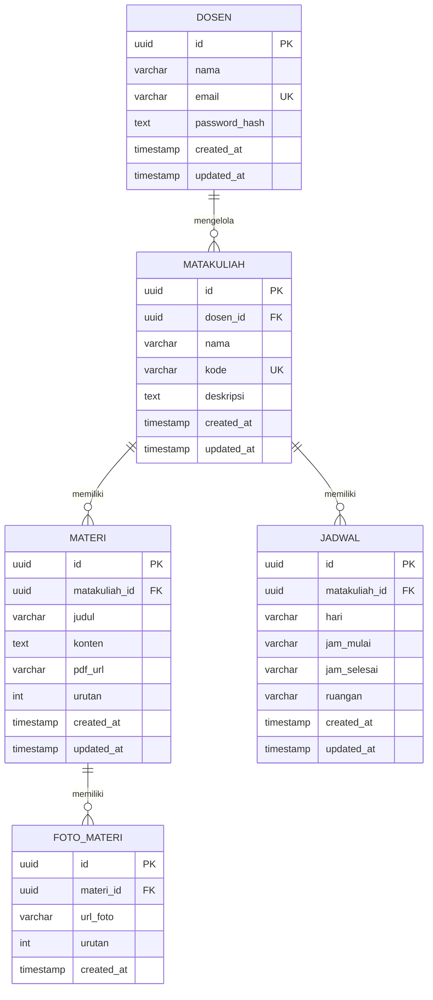

# Rancangan Arsitektur Database — RetDiary

## Ringkasan

Dokumen ini merinci rancangan database RetDiary secara lengkap, mencakup Entity Relationship Diagram (ERD), skema tabel, indeks, constraint, dan catatan desain yang relevan. Database menggunakan **PostgreSQL** dengan **Prisma ORM** sebagai lapisan akses data.

---

## 1. Diagram Entity Relationship (ERD)



---

## 2. Relasi Antar Tabel

| Tabel Induk | Tabel Anak | Relasi | Keterangan |
|---|---|---|---|
| `dosen` | `matakuliah` | One-to-Many | Satu dosen dapat mengelola banyak matakuliah |
| `matakuliah` | `materi` | One-to-Many | Satu matakuliah memiliki banyak materi |
| `matakuliah` | `jadwal` | One-to-Many | Satu matakuliah memiliki banyak jadwal perkuliahan |
| `materi` | `foto_materi` | One-to-Many | Satu materi dapat memiliki banyak foto pendukung |

---

## 3. Skema Tabel Detail

### 3.1 Tabel `dosen`

Menyimpan data akun dosen untuk keperluan autentikasi pada panel admin.

| Kolom | Tipe Data | Constraint | Keterangan |
|---|---|---|---|
| `id` | `UUID` | `PRIMARY KEY`, `DEFAULT gen_random_uuid()` | Identifier unik dosen |
| `nama` | `VARCHAR(150)` | `NOT NULL` | Nama lengkap dosen |
| `email` | `VARCHAR(255)` | `NOT NULL`, `UNIQUE` | Email login, digunakan sebagai username |
| `password_hash` | `TEXT` | `NOT NULL` | Password yang sudah di-hash menggunakan bcrypt/argon2 |
| `created_at` | `TIMESTAMP WITH TIME ZONE` | `NOT NULL`, `DEFAULT NOW()` | Waktu data dibuat |
| `updated_at` | `TIMESTAMP WITH TIME ZONE` | `NOT NULL`, `DEFAULT NOW()` | Waktu data terakhir diperbarui |

> **Catatan:** `password_hash` tidak pernah disimpan dalam bentuk plaintext. Seluruh proses hashing ditangani di lapisan backend (service).

---

### 3.2 Tabel `matakuliah`

Menyimpan data matakuliah yang dikelola oleh dosen.

| Kolom | Tipe Data | Constraint | Keterangan |
|---|---|---|---|
| `id` | `UUID` | `PRIMARY KEY`, `DEFAULT gen_random_uuid()` | Identifier unik matakuliah |
| `dosen_id` | `UUID` | `NOT NULL`, `FOREIGN KEY → dosen(id)` | Referensi ke tabel `dosen` |
| `nama` | `VARCHAR(200)` | `NOT NULL` | Nama matakuliah |
| `kode` | `VARCHAR(20)` | `NOT NULL`, `UNIQUE` | Kode matakuliah, bersifat unik (FR-14A) |
| `deskripsi` | `TEXT` | `NULLABLE` | Deskripsi singkat matakuliah |
| `created_at` | `TIMESTAMP WITH TIME ZONE` | `NOT NULL`, `DEFAULT NOW()` | Waktu data dibuat |
| `updated_at` | `TIMESTAMP WITH TIME ZONE` | `NOT NULL`, `DEFAULT NOW()` | Waktu data terakhir diperbarui |

**Referential Action:**
- `ON DELETE CASCADE` pada `dosen_id`: Jika dosen dihapus, seluruh matakuliah miliknya ikut terhapus.

---

### 3.3 Tabel `materi`

Tabel inti sistem, menyimpan seluruh konten materi perkuliahan dalam berbagai format.

| Kolom | Tipe Data | Constraint | Keterangan |
|---|---|---|---|
| `id` | `UUID` | `PRIMARY KEY`, `DEFAULT gen_random_uuid()` | Identifier unik materi |
| `matakuliah_id` | `UUID` | `NOT NULL`, `FOREIGN KEY → matakuliah(id)` | Referensi ke tabel `matakuliah` |
| `judul` | `VARCHAR(300)` | `NOT NULL` | Judul/nama materi pertemuan |
| `konten` | `TEXT` | `NULLABLE` | Isi materi berupa teks panjang |
| `pdf_url` | `VARCHAR(500)` | `NULLABLE` | URL/path ke berkas PDF yang tersimpan di object storage |
| `urutan` | `INTEGER` | `NOT NULL` | Nomor urut pertemuan, digunakan untuk penyusunan dan rekomendasi materi |
| `created_at` | `TIMESTAMP WITH TIME ZONE` | `NOT NULL`, `DEFAULT NOW()` | Waktu data dibuat |
| `updated_at` | `TIMESTAMP WITH TIME ZONE` | `NOT NULL`, `DEFAULT NOW()` | Waktu data terakhir diperbarui |

**Aturan Bisnis:**
- Minimal satu dari kolom `konten`, `pdf_url`, atau minimal satu `foto_materi` harus terisi (validasi di lapisan aplikasi, FR-22).
- Kolom `urutan` digunakan untuk implementasi *infinite scroll* (FR-06) dan fitur rekomendasi materi (FR-28).

**Referential Action:**
- `ON DELETE CASCADE` pada `matakuliah_id`: Jika matakuliah dihapus, seluruh materi di dalamnya ikut terhapus (FR-16).

---

### 3.4 Tabel `foto_materi`

Menyimpan referensi foto-foto pendukung yang terhubung ke suatu materi.

| Kolom | Tipe Data | Constraint | Keterangan |
|---|---|---|---|
| `id` | `UUID` | `PRIMARY KEY`, `DEFAULT gen_random_uuid()` | Identifier unik foto |
| `materi_id` | `UUID` | `NOT NULL`, `FOREIGN KEY → materi(id)` | Referensi ke tabel `materi` |
| `url_foto` | `VARCHAR(500)` | `NOT NULL` | URL/path ke file gambar yang tersimpan di object storage |
| `urutan` | `INTEGER` | `NOT NULL`, `DEFAULT 1` | Urutan tampil foto dalam galeri |
| `created_at` | `TIMESTAMP WITH TIME ZONE` | `NOT NULL`, `DEFAULT NOW()` | Waktu data dibuat |

**Catatan:**
- File foto asli **tidak** disimpan di database, melainkan di object storage.
- Foto dikompresi dan dikonversi ke format **WebP** saat upload menggunakan library `sharp` (NFR-1.4).

**Referential Action:**
- `ON DELETE CASCADE` pada `materi_id`: Jika materi dihapus, seluruh foto pendukungnya ikut terhapus (FR-18).

---

### 3.5 Tabel `jadwal`

Menyimpan informasi jadwal perkuliahan yang terhubung ke matakuliah.

| Kolom | Tipe Data | Constraint | Keterangan |
|---|---|---|---|
| `id` | `UUID` | `PRIMARY KEY`, `DEFAULT gen_random_uuid()` | Identifier unik jadwal |
| `matakuliah_id` | `UUID` | `NOT NULL`, `FOREIGN KEY → matakuliah(id)` | Referensi ke tabel `matakuliah` |
| `hari` | `VARCHAR(15)` | `NOT NULL` | Nama hari (contoh: "Senin", "Selasa") |
| `jam_mulai` | `VARCHAR(5)` | `NOT NULL` | Jam mulai dalam format `HH:MM` (contoh: "08:00") |
| `jam_selesai` | `VARCHAR(5)` | `NOT NULL` | Jam selesai dalam format `HH:MM` (contoh: "09:40") |
| `ruangan` | `VARCHAR(50)` | `NOT NULL` | Nama atau kode ruangan perkuliahan |
| `created_at` | `TIMESTAMP WITH TIME ZONE` | `NOT NULL`, `DEFAULT NOW()` | Waktu data dibuat |
| `updated_at` | `TIMESTAMP WITH TIME ZONE` | `NOT NULL`, `DEFAULT NOW()` | Waktu data terakhir diperbarui |

**Referential Action:**
- `ON DELETE CASCADE` pada `matakuliah_id`: Jika matakuliah dihapus, seluruh jadwalnya ikut terhapus (FR-16).

---

## 4. Indeks Database

Indeks berikut diterapkan untuk mendukung target performa NFR-1.2 (response time API publik < 300ms).

| Nama Indeks | Tabel | Kolom | Jenis | Tujuan |
|---|---|---|---|---|
| `idx_matakuliah_dosen_id` | `matakuliah` | `dosen_id` | B-Tree | Mempercepat query list matakuliah per dosen (admin dashboard) |
| `idx_matakuliah_kode` | `matakuliah` | `kode` | B-Tree, Unique | Validasi keunikan kode matakuliah (FR-14A) |
| `idx_materi_matakuliah_id` | `materi` | `matakuliah_id` | B-Tree | Mempercepat query daftar materi dalam matakuliah (FR-05, FR-06) |
| `idx_materi_urutan` | `materi` | `matakuliah_id, urutan` | B-Tree Composite | Mempercepat pengurutan dan query rekomendasi materi berikutnya (FR-28) |
| `idx_materi_search` | `materi` | `judul` | GIN / Full-Text | Mendukung fitur pencarian materi berbasis kata kunci (FR-03) |
| `idx_matakuliah_search` | `matakuliah` | `nama, kode` | GIN / Full-Text | Mendukung fitur pencarian matakuliah berbasis kata kunci (FR-03) |
| `idx_foto_materi_materi_id` | `foto_materi` | `materi_id` | B-Tree | Mempercepat pengambilan galeri foto per materi (FR-09) |
| `idx_jadwal_matakuliah_id` | `jadwal` | `matakuliah_id` | B-Tree | Mempercepat query jadwal per matakuliah (FR-32) |

---

## 5. Skema Prisma (ORM)

```prisma
// schema.prisma

generator client {
  provider = "prisma-client-js"
}

datasource db {
  provider = "postgresql"
  url      = env("DATABASE_URL")
}

model Dosen {
  id            String       @id @default(dbgenerated("gen_random_uuid()")) @db.Uuid
  nama          String       @db.VarChar(150)
  email         String       @unique @db.VarChar(255)
  passwordHash  String       @map("password_hash") @db.Text
  createdAt     DateTime     @default(now()) @map("created_at") @db.Timestamptz
  updatedAt     DateTime     @updatedAt @map("updated_at") @db.Timestamptz
  matakuliah    Matakuliah[]

  @@map("dosen")
}

model Matakuliah {
  id        String   @id @default(dbgenerated("gen_random_uuid()")) @db.Uuid
  dosenId   String   @map("dosen_id") @db.Uuid
  nama      String   @db.VarChar(200)
  kode      String   @unique @db.VarChar(20)
  deskripsi String?  @db.Text
  createdAt DateTime @default(now()) @map("created_at") @db.Timestamptz
  updatedAt DateTime @updatedAt @map("updated_at") @db.Timestamptz
  dosen     Dosen    @relation(fields: [dosenId], references: [id], onDelete: Cascade)
  materi    Materi[]
  jadwal    Jadwal[]

  @@index([dosenId])
  @@map("matakuliah")
}

model Materi {
  id            String       @id @default(dbgenerated("gen_random_uuid()")) @db.Uuid
  matakuliahId  String       @map("matakuliah_id") @db.Uuid
  judul         String       @db.VarChar(300)
  konten        String?      @db.Text
  pdfUrl        String?      @map("pdf_url") @db.VarChar(500)
  urutan        Int
  createdAt     DateTime     @default(now()) @map("created_at") @db.Timestamptz
  updatedAt     DateTime     @updatedAt @map("updated_at") @db.Timestamptz
  matakuliah    Matakuliah   @relation(fields: [matakuliahId], references: [id], onDelete: Cascade)
  fotoMateri    FotoMateri[]

  @@index([matakuliahId])
  @@index([matakuliahId, urutan])
  @@map("materi")
}

model FotoMateri {
  id        String   @id @default(dbgenerated("gen_random_uuid()")) @db.Uuid
  materiId  String   @map("materi_id") @db.Uuid
  urlFoto   String   @map("url_foto") @db.VarChar(500)
  urutan    Int      @default(1)
  createdAt DateTime @default(now()) @map("created_at") @db.Timestamptz
  materi    Materi   @relation(fields: [materiId], references: [id], onDelete: Cascade)

  @@index([materiId])
  @@map("foto_materi")
}

model Jadwal {
  id           String     @id @default(dbgenerated("gen_random_uuid()")) @db.Uuid
  matakuliahId String     @map("matakuliah_id") @db.Uuid
  hari         String     @db.VarChar(15)
  jamMulai     String     @map("jam_mulai") @db.VarChar(5)
  jamSelesai   String     @map("jam_selesai") @db.VarChar(5)
  ruangan      String     @db.VarChar(50)
  createdAt    DateTime   @default(now()) @map("created_at") @db.Timestamptz
  updatedAt    DateTime   @updatedAt @map("updated_at") @db.Timestamptz
  matakuliah   Matakuliah @relation(fields: [matakuliahId], references: [id], onDelete: Cascade)

  @@index([matakuliahId])
  @@map("jadwal")
}
```

---

## 6. Catatan Desain

### 6.1 Pengelolaan ID
- Seluruh primary key menggunakan **UUID v4** yang di-generate oleh PostgreSQL (`gen_random_uuid()`), bukan auto-increment integer.
- Tujuan: mencegah ID dapat ditebak dari luar (NFR-4.1), penting untuk endpoint publik yang tidak memerlukan autentikasi.

### 6.2 Penyimpanan File
- Kolom `pdf_url` dan `url_foto` hanya menyimpan **URL atau path relatif** ke file, **bukan** binary file itu sendiri.
- File asli disimpan di **object storage** (lokal pada tahap dev, dapat dipindah ke layanan cloud seperti S3 atau Cloudinary).
- Foto diproses dengan `sharp` saat upload: dikompresi, dikonversi ke WebP, dan disimpan dalam 2-3 ukuran (thumbnail, medium, original).

### 6.3 Nullable Fields
- Kolom `konten` dan `pdf_url` pada tabel `materi` bersifat **nullable** karena satu materi bisa terdiri dari:
  - Tulisan saja, PDF saja, Foto saja, atau kombinasi ketiganya.
- Validasi "minimal satu konten wajib ada" dilakukan di **lapisan service NestJS**, bukan di level database constraint.

### 6.4 Cascade Delete
- Seluruh relasi menggunakan `ON DELETE CASCADE` untuk menjaga integritas data:
  - Hapus **dosen** → hapus semua matakuliahnya secara rekursif
  - Hapus **matakuliah** → hapus semua materi dan jadwalnya
  - Hapus **materi** → hapus semua foto pendukungnya

### 6.5 Timestamps & Audit
- Seluruh tabel utama memiliki `created_at` dan `updated_at` untuk keperluan audit log (FR-31).
- Kolom `updated_at` diperbarui otomatis oleh Prisma menggunakan direktif `@updatedAt`.

### 6.6 Naming Convention
- Nama tabel: **snake_case** (contoh: `foto_materi`, `matakuliah`)
- Nama kolom: **snake_case** (contoh: `matakuliah_id`, `pdf_url`)
- Prisma model name: **PascalCase** dengan `@@map()` ke nama tabel snake_case
- Prisma field name: **camelCase** dengan `@map()` ke nama kolom snake_case

---

## 7. Pertimbangan Skalabilitas & Performa

| Aspek | Strategi |
|---|---|
| **Pagination** | Gunakan cursor-based pagination (`matakuliah_id + urutan`) pada endpoint list materi untuk performa stabil saat data bertambah |
| **Caching** | Hasil query list matakuliah dan materi di-cache di Redis dengan TTL 5-10 menit, invalidasi otomatis saat ada perubahan data (NFR-1.2) |
| **Connection Pool** | Koneksi PostgreSQL menggunakan connection pooling melalui Prisma untuk mendukung 500 concurrent users (NFR-2.1) |
| **Full-text Search** | Gunakan ekstensi `pg_trgm` PostgreSQL untuk pencarian fuzzy yang efisien pada nama matakuliah dan judul materi (FR-03) |
| **Partial Index** | Pertimbangkan partial index pada kolom `pdf_url IS NOT NULL` untuk query yang hanya menargetkan materi dengan PDF |
